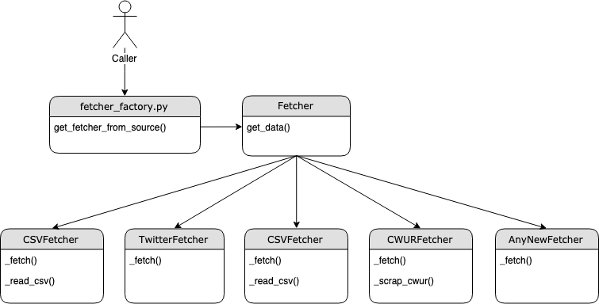

### ETL 

This package contains the classes responsible for data fetching and loading.
The inheritance of the classes are showed in the diagram below.

The class `Fetcher` serves as a parent class having implemented the public method `get_data()` which wraps the private
 abstract method `_fetch()`. The latter is the contract that each sub-class of the parent class should implement in 
 order to be considered as a fetcher child class. Along with the Fetcher class hierarchy, there is a factory method 
 that returns the needed fetcher class according to the given input. In that way, the caller accesses only the data 
 without the knowledge of the specific implementation of the fetching mechanism. On the other hand, each new fetcher 
 does not need to bother about connecting to the rest of the API since the parent class performs all the orchestration 
 outside the class scope.





Bellow is the code example of calling a csv fetcher.

```python
from src.etl.fetcher_factory import get_fetcher_from_source

data_fetcher = get_fetcher_from_source('CSV')
data = data_fetcher.get_data(separator='\t')
```

