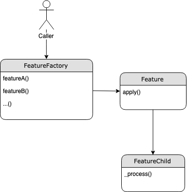

### Feature extraction 

This package contains the classes responsible for feature extraction and pre-processing.
The inheritance of the classes are showed in the diagram below.

The class `Feature` serves as a parent class having implemented the public method `apply()` which wraps the private
 abstract method `_process()`. The latter is the contract that each sub-class of the parent class should implement in 
 order to be considered as a feature child class. Along with the Feature class hierarchy, there is a factory method 
 that returns the needed feature class according to the called class method. In that way, the caller uses the feature
 without the knowledge of the specific implementation (class) that need to call. Also, by using class methods in the 
 factory class, the caller is able to see the supported feature extraction mechanisms. On the other hand, each new 
 feature does not need to bother about connecting to the rest of the API since the parent class performs all the 
 orchestration outside the class scope.
 




Bellow is the code example of calling a word count feature.

```python
from src.feature_extraction.feature_factory import FeatureFactory

# get data
data = ...

# set features configuration
feature_set = [FeatureFactory.word_count(columns=['sentence'], new_column='word_count')]

# extract features
for feature in feature_set:
    x = feature.apply(data)
```

